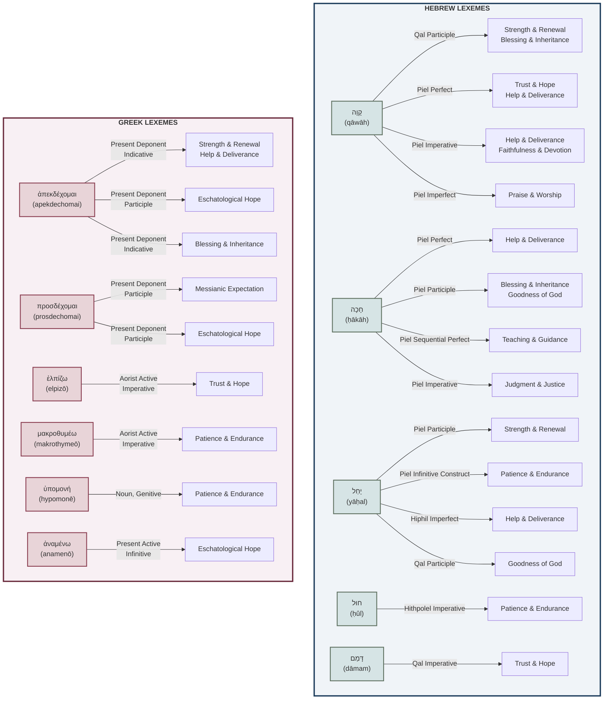

# Lexeme-Form-Theme Overview

This diagram illustrates the relationships between:
- **Lexemes** (Hebrew/Greek words for "waiting")
- **Grammatical Forms** (verb stems, tenses, moods)
- **Thematic Categories** (theological significance in Scripture)
