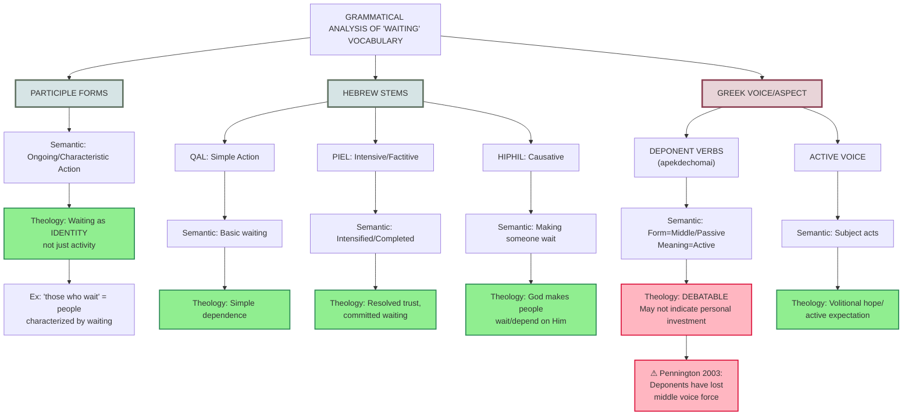

# Option A: Grammar-First Decision Tree

This diagram emphasizes the CAUSAL CHAIN from grammatical feature → semantic contribution → theological inference, making the relationship explicit and falsifiable.

**Strengths:**
- Shows explicit causal chain: Form → Semantics → Theology
- Makes claims falsifiable (can test each step)
- Highlights which connections are strong vs. weak
- Includes scholarly caution where appropriate

**Use when:** You want to defend the grammar→theology connection and show your reasoning
