# Option B: Matrix/Heatmap

This visualization shows which grammatical forms CLUSTER with which themes, revealing patterns vs. outliers and the strength of form-theme correlations.

```mermaid
%%{init: {'theme':'base'}}%%
graph TB
    subgraph Legend
        Strong["█████ Strong (5+ occurrences)"]
        Moderate["███ Moderate (3-4 occurrences)"]
        Weak["█ Weak (1-2 occurrences)"]
        None["  None (0 occurrences)"]
    end

    subgraph Matrix["HEBREW STEMS × THEMES"]
        direction TB

        H1["<b>Strength & Renewal</b>"]
        H1 --> H1Qal["Qal: ███"]
        H1 --> H1Piel["Piel: ██"]
        H1 --> H1Hiphil["Hiphil: "]
        H1 --> H1Part["Participle: █████"]

        H2["<b>Trust & Hope</b>"]
        H2 --> H2Qal["Qal: ██"]
        H2 --> H2Piel["Piel: ████"]
        H2 --> H2Hiphil["Hiphil: █"]
        H2 --> H2Part["Participle: "]

        H3["<b>Help & Deliverance</b>"]
        H3 --> H3Qal["Qal: "]
        H3 --> H3Piel["Piel: ███"]
        H3 --> H3Hiphil["Hiphil: ████"]
        H3 --> H3Part["Participle: ██"]

        H4["<b>Patience & Endurance</b>"]
        H4 --> H4Qal["Qal: "]
        H4 --> H4Piel["Piel: ██"]
        H4 --> H4Hiphil["Hiphil: ██"]
        H4 --> H4Part["Participle: ███"]
    end

    subgraph GMatrix["GREEK ASPECT × THEMES"]
        direction TB

        G1["<b>Eschatological Hope</b>"]
        G1 --> G1Pres["Present: █████"]
        G1 --> G1Aor["Aorist: "]
        G1 --> G1Part["Participle: ███"]

        G2["<b>Patience & Endurance</b>"]
        G2 --> G2Pres["Present: "]
        G2 --> G2Aor["Aorist: ████"]
        G2 --> G2Part["Participle: "]

        G3["<b>Messianic Expectation</b>"]
        G3 --> G3Pres["Present: "]
        G3 --> G3Aor["Aorist: "]
        G3 --> G3Part["Participle: █████"]
    end

    style H1 fill:#1B3B5A,color:#FFF,stroke:#FFF,stroke-width:2px
    style H2 fill:#1B3B5A,color:#FFF,stroke:#FFF,stroke-width:2px
    style H3 fill:#1B3B5A,color:#FFF,stroke:#FFF,stroke-width:2px
    style H4 fill:#1B3B5A,color:#FFF,stroke:#FFF,stroke-width:2px

    style G1 fill:#6B2C3E,color:#FFF,stroke:#FFF,stroke-width:2px
    style G2 fill:#6B2C3E,color:#FFF,stroke:#FFF,stroke-width:2px
    style G3 fill:#6B2C3E,color:#FFF,stroke:#FFF,stroke-width:2px
```

## Actual Data Matrix (from your source_data.json):

### Hebrew: Stem × Theme

| Theme                  | Qal Part | Piel Perf | Piel Part | Piel Imp | Hiphil |
|------------------------|----------|-----------|-----------|----------|--------|
| Strength & Renewal     | ████     | █         | ██        |          |        |
| Trust & Hope           | █        | ███       |           | █        |        |
| Help & Deliverance     |          | ██        |           | ██       | █      |
| Patience & Endurance   |          | █         | █         | █        | █      |
| Blessing & Inheritance | ██       |           | █         |          |        |
| Judgment & Justice     |          |           |           | █        |        |

### Greek: Aspect × Theme

| Theme                  | Pres Indic | Pres Part | Aor Imp | Noun |
|------------------------|------------|-----------|---------|------|
| Eschatological Hope    | ███        | ██        |         |      |
| Patience & Endurance   |            |           | ██      | █    |
| Messianic Expectation  |            | ██        |         |      |
| Trust & Hope           |            |           | █       |      |

**Insights from Heatmap:**
1. **Qal Participle strongly clusters with Strength & Renewal** (supports identity claim)
2. **Piel Perfect clusters with Trust & Hope** (completed/intensive action)
3. **Hiphil spreads across Help & Deliverance themes** (causative: God acts)
4. **Greek Present concentrates in Eschatological Hope** (ongoing expectation)
5. **Outliers exist** - not every form→theme connection is systematic

**Strengths:**
- Reveals actual distribution patterns
- Shows which claims are well-supported vs. anecdotal
- Identifies systematic correlations vs. exceptions

**Use when:** You want to show empirical evidence for grammar-theme correlations
