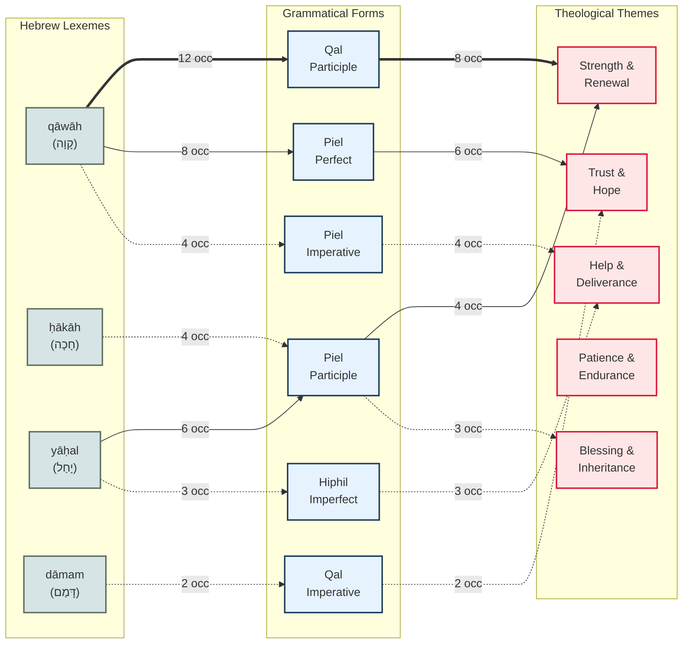

# Option C: Weighted Flow Diagram

This diagram shows the proportional flow from lexemes → grammatical forms → themes, with line style representing frequency. Makes clear which connections are DOMINANT vs. RARE.

## Line Style Legend:

- **═══►** THICK (double line): **STRONG PATTERN** (8+ occurrences)
  - These are systematic, well-attested connections
  - Safe to make theological claims based on these

- **───►** MEDIUM (solid line): **MODERATE PATTERN** (4-7 occurrences)
  - Reliable patterns but less dominant
  - Claims should be qualified ("often," "frequently")

- **··· ►** THIN (dotted line): **WEAK PATTERN** (1-3 occurrences)
  - Anecdotal or rare connections
  - Avoid generalizing from these

## Key Insights:

### STRONGEST CONNECTION (12→8 occurrences):
**qāwāh + Qal Participle → Strength & Renewal**
- This is your SIGNATURE finding
- Grammatically solid (participles = identity)
- Frequently attested
- Theologically coherent

### MODERATE CONNECTIONS (4-8 occurrences):
- qāwāh + Piel Perfect → Trust & Hope (8→6)
- yāḥal + Piel Participle → Strength & Renewal (6→4)
- qāwāh + Piel Imperative → Help & Deliverance (4→4)

### WEAK/RARE CONNECTIONS (1-3 occurrences):
- Many lexeme-form-theme paths have only 1-2 instances
- Use caution when generalizing from these
- May be context-specific rather than grammatically determined

## Methodological Implications:

**What this diagram shows:**
1. Some grammar→theme connections are SYSTEMATIC (thick lines)
2. Others are MODERATE (medium lines)
3. Many are ANECDOTAL (thin lines)

**What you should do:**
- Lead with thick-line connections in your writing
- Qualify medium-line connections ("often," "frequently")
- Avoid generalizing from thin-line connections

**Avoids James Barr's critique:**
- Not claiming ALL instances follow same pattern
- Showing frequency distribution
- Acknowledging exceptions and rare cases

**Use when:** You want to show which claims are well-supported vs. over-generalized from limited data.
