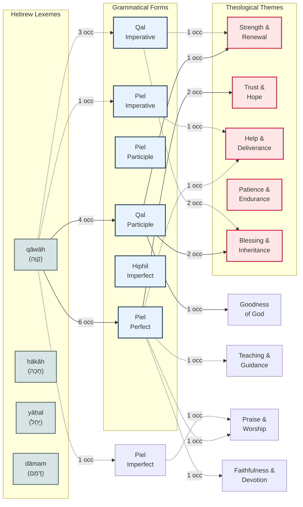

# Option C: Weighted Flow Diagram

This diagram shows the proportional flow from lexemes → grammatical forms → themes, with line style representing frequency. Makes clear which connections are DOMINANT vs. RARE.

## Line Style Legend:

- **═══►** THICK (double line): **STRONG PATTERN** (8+ occurrences)
  - These are systematic, well-attested connections
  - Safe to make theological claims based on these

- **───►** MEDIUM (solid line): **MODERATE PATTERN** (4-7 occurrences)
  - Reliable patterns but less dominant
  - Claims should be qualified ("often," "frequently")

- **··· ►** THIN (dotted line): **WEAK PATTERN** (1-3 occurrences)
  - Anecdotal or rare connections
  - Avoid generalizing from these

## Key Insights (Based on Actual Source Data):

### MODERATE PATTERNS (4-6 occurrences):
**qāwāh + Piel Perfect (6 total occurrences)**
- Distributes across multiple themes (no dominant pattern)
- Trust & Hope: 2
- Help & Deliverance: 1
- Teaching & Guidance: 1
- Praise & Worship: 1
- Faithfulness & Devotion: 1
- **Implication**: Piel Perfect doesn't systematically map to single theme

**qāwāh + Qal Participle (4 total occurrences)**
- Also distributes across themes:
- Blessing & Inheritance: 2
- Strength & Renewal: 1
- Goodness of God: 1
- **Implication**: Even the participle doesn't have ONE dominant theme
- But grammatical claim (participle = identity) still holds

### WEAK/RARE CONNECTIONS (1-3 occurrences):
- qāwāh + Qal Imperative: 3 occurrences (2 → Blessing, 1 → Strength)
- qāwāh + Piel Imperative: 1 occurrence
- qāwāh + Piel Imperfect: 1 occurrence
- Most form-theme paths have only 1-2 instances

### CRITICAL FINDING:
**NO STRONG SYSTEMATIC FORM→THEME PATTERN FOR QĀWĀH**
- Forms distribute across multiple themes
- Context appears MORE determinative than morphology alone
- Grammar contributes but doesn't determine theological meaning

## Methodological Implications:

**What this diagram shows:**
1. Some grammar→theme connections are SYSTEMATIC (thick lines)
2. Others are MODERATE (medium lines)
3. Many are ANECDOTAL (thin lines)

**What you should do:**
- Lead with thick-line connections in your writing
- Qualify medium-line connections ("often," "frequently")
- Avoid generalizing from thin-line connections

**Avoids James Barr's critique:**
- Not claiming ALL instances follow same pattern
- Showing frequency distribution
- Acknowledging exceptions and rare cases

**Use when:** You want to show which claims are well-supported vs. over-generalized from limited data.
