# Option C: Weighted Flow Diagram (Accurate Data)

This diagram shows actual lexeme → form → theme flows based on complete analysis of source_data.json. Line style indicates occurrence frequency.

```mermaid
graph LR
    subgraph Hebrew["Hebrew Lexemes"]
        Q["qāwāh<br/>(קָוָה)<br/>16 total"]
        H["ḥākāh<br/>(חָכָה)<br/>5 total"]
        Y["yāḥal<br/>(יָחַל)<br/>4 total"]
        D["dāmam<br/>(דָּמַם)<br/>1 total"]
        CH["ḥûl<br/>(חוּל)<br/>1 total"]
    end

    subgraph Greek["Greek Lexemes"]
        AP["apekdechomai<br/>(ἀπεκδέχομαι)<br/>6 total"]
        PR["prosdechomai<br/>(προσδέχομαι)<br/>4 total"]
        EL["elpizō<br/>(ἐλπίζω)<br/>1 total"]
        MA["makrothymeō<br/>(μακροθυμέω)<br/>1 total"]
        UP["hypomonē<br/>(ὑπομονή)<br/>1 total"]
        AN["anamenō<br/>(ἀναμένω)<br/>1 total"]
    end

    subgraph Forms["Grammatical Forms"]
        QPart["Qal<br/>Participle"]
        QImp["Qal<br/>Imperative"]
        PPf["Piel<br/>Perfect"]
        PPart["Piel<br/>Participle"]
        PImp["Piel<br/>Imperative"]
        PInf["Piel<br/>Infinitive"]
        HImp["Hiphil<br/>Imperfect"]
        HithImp["Hithpolel<br/>Imperative"]
        PresInd["Present<br/>Indicative"]
        PresPart["Present<br/>Participle"]
        AorImp["Aorist<br/>Imperative"]
    end

    subgraph Themes["Theological Themes"]
        SR["Strength &<br/>Renewal"]
        TH["Trust &<br/>Hope"]
        HD["Help &<br/>Deliverance"]
        PE["Patience &<br/>Endurance"]
        BI["Blessing &<br/>Inheritance"]
        EH["Eschatological<br/>Hope"]
        ME["Messianic<br/>Expectation"]
        GG["Goodness<br/>of God"]
    end

    %% HEBREW: qāwāh (16 occurrences)
    Q -->|"6"| PPf
    Q -->|"4"| QPart
    Q -.->|"3"| QImp
    Q -.->|"1"| PImp
    Q -.->|"1"| PInf
    Q -.->|"1"| PImper["Piel Imperfect"]

    PPf -.->|"2"| TH
    PPf -.->|"1"| HD
    PPf -.->|"1"| TG["Teaching"]
    PPf -.->|"1"| PW["Praise"]
    PPf -.->|"1"| FD["Faithfulness"]

    QPart -.->|"2"| BI
    QPart -.->|"1"| SR
    QPart -.->|"1"| GG

    QImp -.->|"1"| SR
    QImp -.->|"1"| BI
    QImp -.->|"1"| FD

    %% HEBREW: ḥākāh (5 occurrences)
    H -.->|"2"| PPart
    H -.->|"2"| PPfH["Piel Perfect"]
    H -.->|"1"| PImpH["Piel Imperative"]

    PPart -.->|"1"| BI
    PPart -.->|"1"| GG

    PPfH -.->|"1"| HD
    PPfH -.->|"1"| TG

    PImpH -.->|"1"| JJ["Judgment"]

    %% HEBREW: yāḥal (4 occurrences - all single)
    Y -.->|"1"| PPart
    Y -.->|"1"| QImpY["Qal Imperfect"]
    Y -.->|"1"| PInf
    Y -.->|"1"| HImp

    PPart -.->|"1"| SR
    QImpY -.->|"1"| TH
    PInf -.->|"1"| PE
    HImp -.->|"1"| HD

    %% GREEK: apekdechomai (6 occurrences)
    AP -->|"4"| PresInd
    AP -.->|"2"| PresPart

    PresInd -.->|"2"| EH
    PresInd -.->|"1"| SR
    PresInd -.->|"1"| BI

    PresPart -.->|"1"| EH
    PresPart -.->|"1"| HD

    %% GREEK: prosdechomai (4 occurrences)
    PR -->|"4"| PresPart

    PresPart -.->|"3"| ME
    PresPart -.->|"1"| EH

    %% GREEK: Single occurrence lexemes
    D -.->|"1"| QImp
    QImp -.->|"1"| TH

    EL -.->|"1"| AorImp
    AorImp -.->|"1"| TH

    CH -.->|"1"| HithImp
    HithImp -.->|"1"| PE

    MA -.->|"1"| AorImp
    UP -.->|"1"| PE
    AN -.->|"1"| EH

    style Q fill:#D6E4E5,stroke:#5F7161,stroke-width:3px
    style H fill:#D6E4E5,stroke:#5F7161,stroke-width:2px
    style Y fill:#D6E4E5,stroke:#5F7161,stroke-width:2px
    style D fill:#D6E4E5,stroke:#5F7161,stroke-width:1px
    style CH fill:#D6E4E5,stroke:#5F7161,stroke-width:1px

    style AP fill:#E8D4D8,stroke:#8B3F52,stroke-width:3px
    style PR fill:#E8D4D8,stroke:#8B3F52,stroke-width:2px
    style EL fill:#E8D4D8,stroke:#8B3F52,stroke-width:1px
    style MA fill:#E8D4D8,stroke:#8B3F52,stroke-width:1px
    style UP fill:#E8D4D8,stroke:#8B3F52,stroke-width:1px
    style AN fill:#E8D4D8,stroke:#8B3F52,stroke-width:1px
```

## Accurate Data Summary

### HEBREW VOCABULARY

**qāwāh (קָוָה) - 16 occurrences (most common)**
- Piel Perfect (6): Scattered across 6 themes - NO dominant pattern
- Qal Participle (4): BI(2), SR(1), GG(1) - Mild clustering to Blessing
- Qal Imperative (3): SR(1), BI(1), FD(1) - Completely distributed
- Singles: Piel Imp(1), Piel Inf(1), Piel Impf(1)

**ḥākāh (חָכָה) - 5 occurrences**
- Piel Participle (2): BI(1), GG(1)
- Piel Perfect (2): HD(1), Teaching(1)
- Piel Imperative (1): Judgment(1)

**yāḥal (יָחַל) - 4 occurrences**
- All forms have only 1 occurrence each - NO patterns possible

**Other Hebrew**: dāmam(1), ḥûl(1) - Too few for analysis

### GREEK VOCABULARY

**apekdechomai (ἀπεκδέχομαι) - 6 occurrences**
- Present Indicative (4): EH(2), SR(1), BI(1) - MILD eschatological lean
- Present Participle (2): EH(1), HD(1)

**prosdechomai (προσδέχομαι) - 4 occurrences**
- Present Participle (4): ME(3), EH(1) - **STRONGEST PATTERN** (75% Messianic)

**Other Greek**: elpizō(1), makrothymeō(1), hypomonē(1), anamenō(1) - Singles only

## Line Style Legend:

- **───►** SOLID (4-6 occurrences): Moderate frequency, still distributed
- **··· ►** DOTTED (1-3 occurrences): Low frequency, often single instances

## Critical Findings:

### 1. **ONLY ONE STRONG PATTERN EXISTS:**
**prosdechomai Present Participle → Messianic Expectation (3 of 4 = 75%)**
- Luke 2:25, 38; Mark 15:43 all describe waiting for Messiah/redemption
- This IS a genuine form→theme correlation
- Context: All NT, all messianic expectation contexts

### 2. **NO STRONG HEBREW PATTERNS:**
- qāwāh Piel Perfect (6 occ) → 6 different themes (complete scatter)
- qāwāh Qal Participle (4 occ) → 3 themes, only mild Blessing clustering (50%)
- ḥākāh forms all have 1-2 occurrences only

### 3. **MILD GREEK ESCHATOLOGICAL PATTERN:**
- apekdechomai Present Indicative (4 occ) → 50% Eschatological Hope
- But also shows SR(1), BI(1) - still distributed

### 4. **MOST CONNECTIONS ARE 1-2 OCCURRENCES:**
- yāḥal: All 4 forms have exactly 1 occurrence
- Most qāwāh forms: 1 occurrence each
- Cannot generalize from single instances

## Methodological Implications:

**What the actual data shows:**
1. ✅ **Grammar matters for participles** (identity vs. action) - this claim still holds
2. ✅ **ONE strong form→theme pattern**: prosdechomai participles → Messianic hope
3. ⚠️ **Hebrew patterns are WEAK**: Forms distribute across themes
4. ❌ **NO systematic Piel→intensive→theme pattern**: Piel Perfect hits 6 themes
5. ✅ **Context > Morphology**: Theme selection depends on literary context more than form

**What you should claim:**
- "Participles characteristically express identity" ✓ (grammatical claim, not thematic)
- "prosdechomai participles cluster in messianic expectation contexts" ✓ (75% = strong)
- "apekdechomai shows mild eschatological tendency" ✓ (50% = mild)
- ❌ DON'T claim: "Qal participles → Strength & Renewal" (only 1 of 4 = 25%)
- ❌ DON'T claim: "Piel intensifies waiting" (no thematic pattern from Piel)

**How this strengthens your study:**
- Honest about data = more credible
- Acknowledges context matters = avoids Barr's critique
- Finds ONE real pattern = not claiming false systematicity
- Shows you did the statistical work = rigorous

**Use when:** You want to show you've analyzed the data honestly and found that while grammar contributes meaningfully to interpretation, context is the primary determinant of theological theme.
