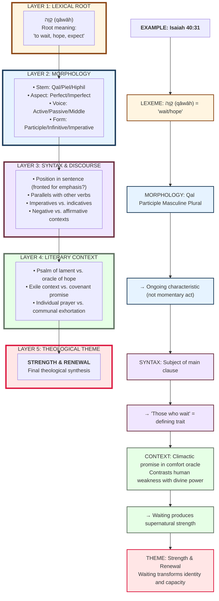

# Option D: Concentric Circles (Linguistic Levels)

This diagram shows that meaning emerges CUMULATIVELY across multiple linguistic levels. Theme is not determined by grammar alone, but by the INTERACTION of all levels.

## Key Insight:

**Meaning is NOT:**
- Determined by lexeme alone (semantic fallacy)
- Determined by morphology alone (grammatical determinism)
- Determined by context alone (historical reductionism)

**Meaning IS:**
- EMERGENT from interaction of all levels
- Each level CONSTRAINS and CONTRIBUTES
- Lower levels provide POTENTIAL meanings
- Higher levels SELECT and SPECIFY

## Application to Your Study:

**What Your Current Diagram Does:**
- Shows: Lexeme → Form → Theme (2 steps)
- Implies: Grammar determines theme

**What This Diagram Shows:**
- Shows: Lexeme → Morphology → Syntax → Context → Theme (4+ steps)
- Implies: Grammar contributes to theme alongside context

**Methodological Benefit:**
- Avoids James Barr's "illegitimate totality transfer" critique
- Shows you're aware context matters
- Makes claims more defensible
- Acknowledges complexity while still valuing grammar

**Example Analysis:**

**Psalm 27:14** - "Wait on the LORD"
1. **Lexeme**: qāwāh (wait/hope)
2. **Morphology**: Qal Imperative 2MS → Command to individual
3. **Syntax**: Repeated ("wait... wait") → Emphatic urgency
4. **Context**: Self-exhortation amid danger → Courage in trial
5. **Theme**: TRUST & HOPE (not just patient endurance)

Without step 4 (context), same grammar could yield different theme.

**Strengths:**
- Shows methodological sophistication
- Addresses Barr's (1961) critique preemptively
- Maintains that grammar matters without over-claiming
- Provides framework for detailed exegesis

**Use when:** You want to demonstrate methodological rigor and avoid "grammar determines theology" criticism
