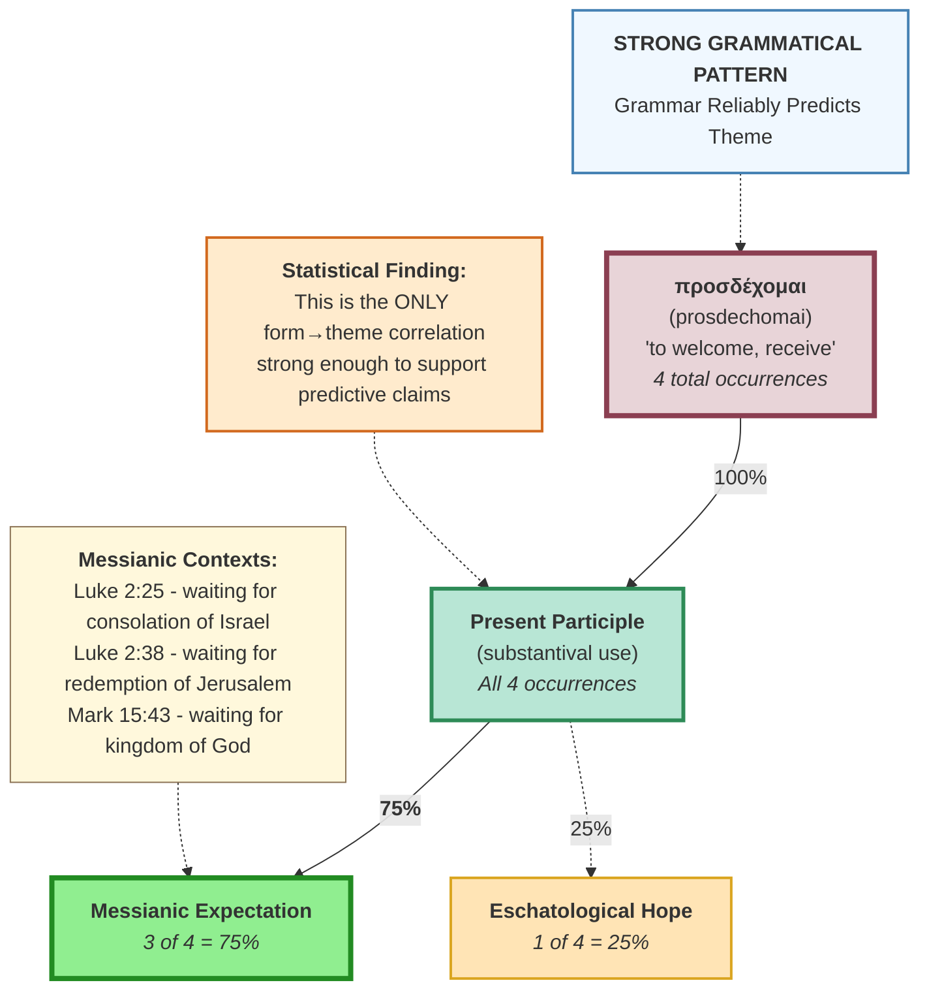

# Strong Grammatical Pattern: prosdechomai

This diagram shows the ONE statistically strong form→theme correlation found in the data: prosdechomai Present Participle → Messianic Expectation (75% correlation).

## Key Insights

**Why This Pattern Is Strong:**
1. **High correlation**: 75% (3 of 4) consistently point to one theme
2. **Contextual consistency**: All three messianic uses are in Gospel narratives about expectation of Messiah's coming
3. **Grammatical contribution**: Participle form emphasizes characteristic identity ("those who wait") rather than momentary action
4. **Predictive value**: When encountering prosdechomai participle, messianic expectation is the most likely theme

**Limitations:**
- Small sample size (only 4 occurrences total)
- 25% still point to different theme (Titus 2:13 - eschatological)
- Pattern found only in NT Greek, not Hebrew vocabulary

**Methodological Significance:**
- Demonstrates that grammar CAN correlate with theology when conditions are right
- Shows value of statistical analysis over impressionistic claims
- Validates participle analysis while avoiding over-generalization
