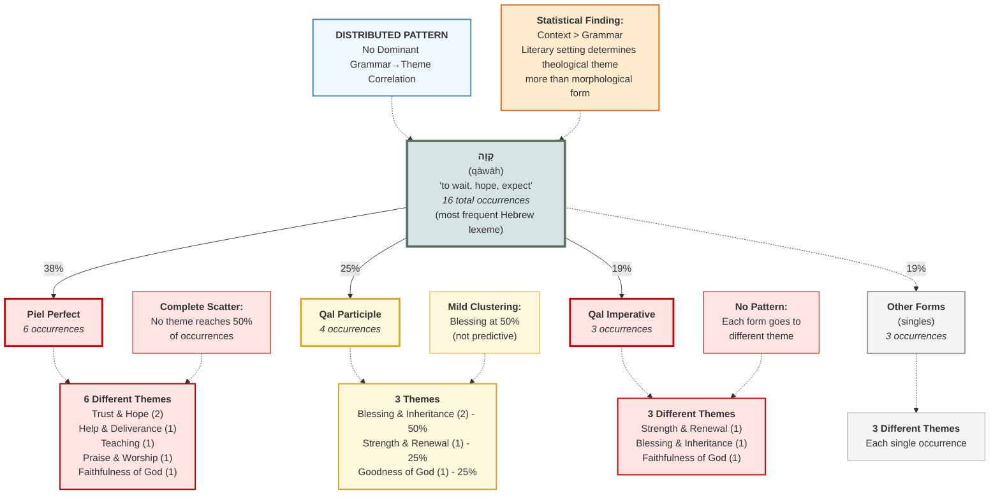

# Weak Grammatical Pattern: qāwāh

This diagram shows the TYPICAL pattern found in the data: grammatical forms distribute across multiple themes with no dominant correlation. Context determines theme more than morphology.

## Key Insights

**Why This Pattern Is Weak:**
1. **No dominant correlation**: Piel Perfect (6 occ) hits 6 different themes - complete scatter
2. **Mild clustering only**: Qal Participle shows 50% to Blessing & Inheritance (not strong enough to predict)
3. **Form distribution**: Same form appears in multiple contradictory themes
4. **Sample fragmentation**: Most connections are single instances (cannot generalize)

**What This Reveals:**
- **Grammar contributes**: Participles still express identity/characteristic (grammatical claim holds)
- **Context dominates**: Psalm of lament vs. comfort oracle determines theme more than verb form
- **Stems don't determine theme**: Piel doesn't reliably "intensify" into any particular theological category

**Methodological Implications:**
- Avoid claiming "Qal participle → Strength & Renewal" (only 1 of 4 = 25%)
- Avoid claiming "Piel perfect → Trust & Hope" (only 2 of 6 = 33%)
- Instead claim: "Participles characteristically express identity, which is theologically significant in context"

**Comparison to Strong Pattern:**
- prosdechomai: 75% correlation (strong, predictive)
- qāwāh Qal Participle: 50% correlation (mild, not predictive)
- qāwāh Piel Perfect: 0% dominant theme (weak, scattered)

**This is the NORM, not the exception** - most lexemes in the study show this distributed pattern.
