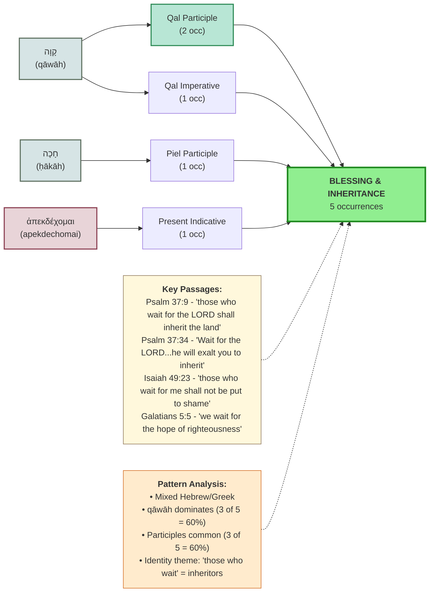

# Theme: Blessing & Inheritance

This diagram shows the grammatical paths that lead to the "Blessing & Inheritance" theme (5 occurrences).

```mermaid
graph LR
    Theme["<b>BLESSING & INHERITANCE</b><br/>5 occurrences"]

    Q["קָוָה<br/>(qāwāh)"]
    H["חָכָה<br/>(ḥākāh)"]
    AP["ἀπεκδέχομαι<br/>(apekdechomai)"]

    QPart["Qal Participle<br/>(2 occ)"]
    QImp["Qal Imperative<br/>(1 occ)"]
    PPart["Piel Participle<br/>(1 occ)"]
    PresInd["Present Indicative<br/>(1 occ)"]

    Q --> QPart
    Q --> QImp
    H --> PPart
    AP --> PresInd

    QPart --> Theme
    QImp --> Theme
    PPart --> Theme
    PresInd --> Theme

    Verses["<b>Key Passages:</b><br/>Psalm 37:9 - 'those who wait for the LORD shall inherit the land'<br/>Psalm 37:34 - 'Wait for the LORD...he will exalt you to inherit'<br/>Isaiah 49:23 - 'those who wait for me shall not be put to shame'<br/>Galatians 5:5 - 'we wait for the hope of righteousness'"]

    Verses -.-> Theme

    Pattern["<b>Pattern Analysis:</b><br/>• Mixed Hebrew/Greek<br/>• qāwāh dominates (3 of 5 = 60%)<br/>• Participles common (3 of 5 = 60%)<br/>• Identity theme: 'those who wait' = inheritors"]

    Pattern -.-> Theme

    style Theme fill:#90EE90,stroke:#228B22,stroke-width:3px
    style Q fill:#D6E4E5,stroke:#5F7161,stroke-width:2px
    style H fill:#D6E4E5,stroke:#5F7161,stroke-width:2px
    style AP fill:#E8D4D8,stroke:#8B3F52,stroke-width:2px
    style QPart fill:#B8E6D5,stroke:#2E8B57,stroke-width:2px
    style Verses fill:#FFF8DC,stroke:#8B7355,stroke-width:1px
    style Pattern fill:#FFEBCD,stroke:#D2691E,stroke-width:1px
```
