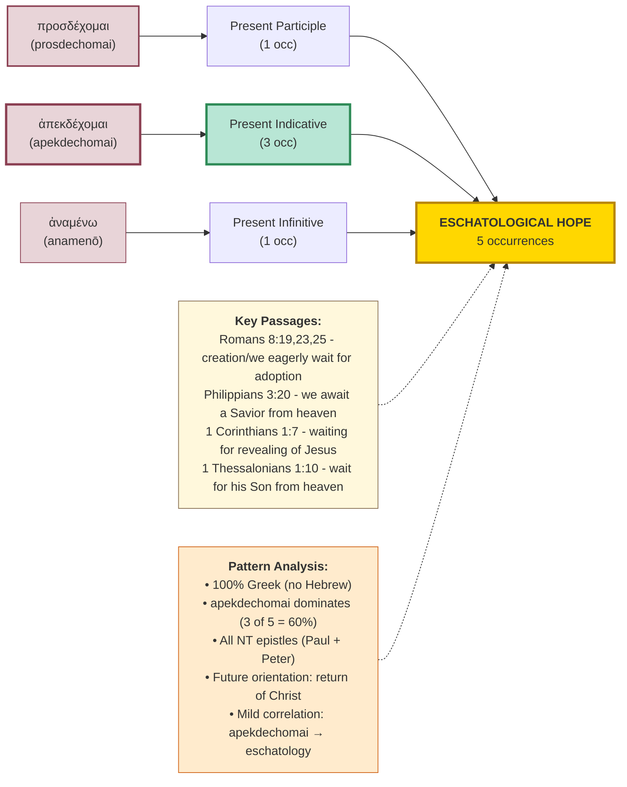

# Theme: Eschatological Hope

This diagram shows the grammatical paths that lead to the "Eschatological Hope" theme (5 occurrences).

```mermaid
graph LR
    Theme["<b>ESCHATOLOGICAL HOPE</b><br/>5 occurrences"]

    PR["προσδέχομαι<br/>(prosdechomai)"]
    AP["ἀπεκδέχομαι<br/>(apekdechomai)"]
    AN["ἀναμένω<br/>(anamenō)"]

    PresPart["Present Participle<br/>(1 occ)"]
    PresInd["Present Indicative<br/>(3 occ)"]
    PresInf["Present Infinitive<br/>(1 occ)"]

    PR --> PresPart
    AP --> PresInd
    AN --> PresInf

    PresPart --> Theme
    PresInd --> Theme
    PresInf --> Theme

    Verses["<b>Key Passages:</b><br/>Romans 8:19,23,25 - creation/we eagerly wait for adoption<br/>Philippians 3:20 - we await a Savior from heaven<br/>1 Corinthians 1:7 - waiting for revealing of Jesus<br/>1 Thessalonians 1:10 - wait for his Son from heaven"]

    Verses -.-> Theme

    Pattern["<b>Pattern Analysis:</b><br/>• 100% Greek (no Hebrew)<br/>• apekdechomai dominates (3 of 5 = 60%)<br/>• All NT epistles (Paul + Peter)<br/>• Future orientation: return of Christ<br/>• Mild correlation: apekdechomai → eschatology"]

    Pattern -.-> Theme

    style Theme fill:#FFD700,stroke:#B8860B,stroke-width:3px
    style PR fill:#E8D4D8,stroke:#8B3F52,stroke-width:2px
    style AP fill:#E8D4D8,stroke:#8B3F52,stroke-width:3px
    style AN fill:#E8D4D8,stroke:#8B3F52,stroke-width:1px
    style PresInd fill:#B8E6D5,stroke:#2E8B57,stroke-width:3px
    style Verses fill:#FFF8DC,stroke:#8B7355,stroke-width:1px
    style Pattern fill:#FFEBCD,stroke:#D2691E,stroke-width:1px
```
