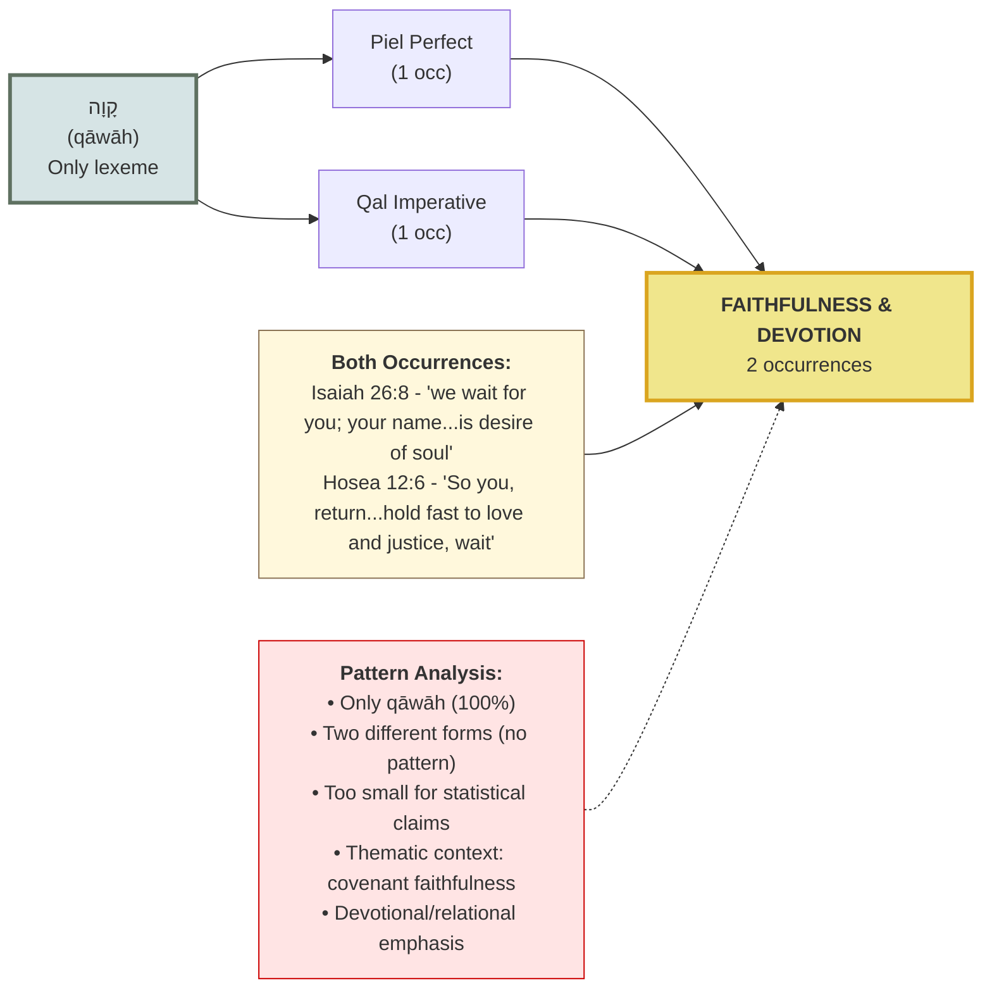

# Theme: Faithfulness & Devotion

This diagram shows the grammatical paths that lead to the "Faithfulness & Devotion" theme (2 occurrences).

```mermaid
graph LR
    Theme["<b>FAITHFULNESS & DEVOTION</b><br/>2 occurrences"]

    Q["קָוָה<br/>(qāwāh)<br/>Only lexeme"]

    PPf["Piel Perfect<br/>(1 occ)"]
    QImp["Qal Imperative<br/>(1 occ)"]

    Q --> PPf
    Q --> QImp

    PPf --> Theme
    QImp --> Theme

    Verses["<b>Both Occurrences:</b><br/>Isaiah 26:8 - 'we wait for you; your name...is desire of soul'<br/>Hosea 12:6 - 'So you, return...hold fast to love and justice, wait'"]

    Verses --> Theme

    Pattern["<b>Pattern Analysis:</b><br/>• Only qāwāh (100%)<br/>• Two different forms (no pattern)<br/>• Too small for statistical claims<br/>• Thematic context: covenant faithfulness<br/>• Devotional/relational emphasis"]

    Pattern -.-> Theme

    style Theme fill:#F0E68C,stroke:#DAA520,stroke-width:3px
    style Q fill:#D6E4E5,stroke:#5F7161,stroke-width:3px
    style Verses fill:#FFF8DC,stroke:#8B7355,stroke-width:1px
    style Pattern fill:#FFE4E4,stroke:#CC0000,stroke-width:1px
```
