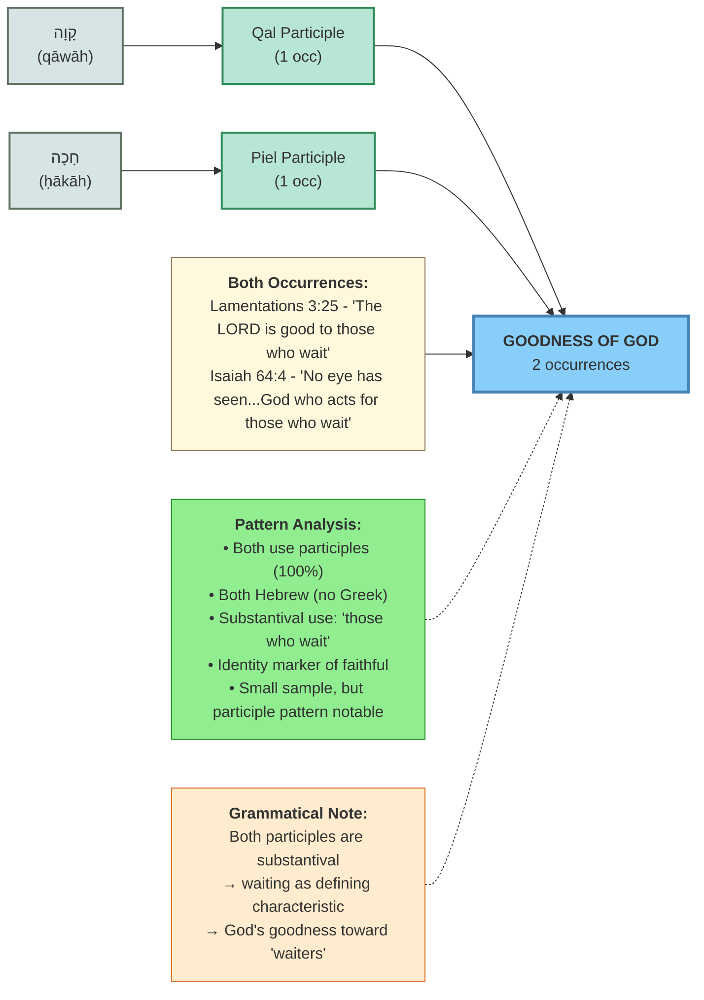

# Theme: Goodness of God

This diagram shows the grammatical paths that lead to the "Goodness of God" theme (2 occurrences).

```mermaid
graph LR
    Theme["<b>GOODNESS OF GOD</b><br/>2 occurrences"]

    Q["קָוָה<br/>(qāwāh)"]
    H["חָכָה<br/>(ḥākāh)"]

    QPart["Qal Participle<br/>(1 occ)"]
    PPart["Piel Participle<br/>(1 occ)"]

    Q --> QPart
    H --> PPart

    QPart --> Theme
    PPart --> Theme

    Verses["<b>Both Occurrences:</b><br/>Lamentations 3:25 - 'The LORD is good to those who wait'<br/>Isaiah 64:4 - 'No eye has seen...God who acts for those who wait'"]

    Verses --> Theme

    Pattern["<b>Pattern Analysis:</b><br/>• Both use participles (100%)<br/>• Both Hebrew (no Greek)<br/>• Substantival use: 'those who wait'<br/>• Identity marker of faithful<br/>• Small sample, but participle pattern notable"]

    Pattern -.-> Theme

    Notable["<b>Grammatical Note:</b><br/>Both participles are substantival<br/>→ waiting as defining characteristic<br/>→ God's goodness toward 'waiters'"]

    Notable -.-> Theme

    style Theme fill:#87CEFA,stroke:#4682B4,stroke-width:3px
    style Q fill:#D6E4E5,stroke:#5F7161,stroke-width:2px
    style H fill:#D6E4E5,stroke:#5F7161,stroke-width:2px
    style QPart fill:#B8E6D5,stroke:#2E8B57,stroke-width:2px
    style PPart fill:#B8E6D5,stroke:#2E8B57,stroke-width:2px
    style Verses fill:#FFF8DC,stroke:#8B7355,stroke-width:1px
    style Pattern fill:#90EE90,stroke:#228B22,stroke-width:1px
    style Notable fill:#FFEBCD,stroke:#D2691E,stroke-width:1px
```
