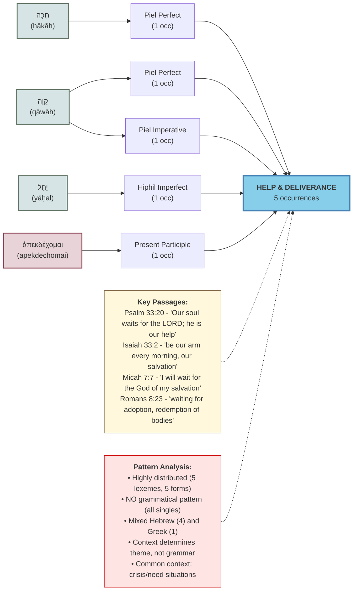

# Theme: Help & Deliverance

This diagram shows the grammatical paths that lead to the "Help & Deliverance" theme (5 occurrences).

```mermaid
graph LR
    Theme["<b>HELP & DELIVERANCE</b><br/>5 occurrences"]

    H["חָכָה<br/>(ḥākāh)"]
    Q["קָוָה<br/>(qāwāh)"]
    Y["יָחַל<br/>(yāḥal)"]
    AP["ἀπεκδέχομαι<br/>(apekdechomai)"]

    PPf["Piel Perfect<br/>(1 occ)"]
    PPf2["Piel Perfect<br/>(1 occ)"]
    PImp["Piel Imperative<br/>(1 occ)"]
    HImp["Hiphil Imperfect<br/>(1 occ)"]
    PresPart["Present Participle<br/>(1 occ)"]

    H --> PPf
    Q --> PPf2
    Q --> PImp
    Y --> HImp
    AP --> PresPart

    PPf --> Theme
    PPf2 --> Theme
    PImp --> Theme
    HImp --> Theme
    PresPart --> Theme

    Verses["<b>Key Passages:</b><br/>Psalm 33:20 - 'Our soul waits for the LORD; he is our help'<br/>Isaiah 33:2 - 'be our arm every morning, our salvation'<br/>Micah 7:7 - 'I will wait for the God of my salvation'<br/>Romans 8:23 - 'waiting for adoption, redemption of bodies'"]

    Verses -.-> Theme

    Pattern["<b>Pattern Analysis:</b><br/>• Highly distributed (5 lexemes, 5 forms)<br/>• NO grammatical pattern (all singles)<br/>• Mixed Hebrew (4) and Greek (1)<br/>• Context determines theme, not grammar<br/>• Common context: crisis/need situations"]

    Pattern -.-> Theme

    style Theme fill:#87CEEB,stroke:#4682B4,stroke-width:3px
    style H fill:#D6E4E5,stroke:#5F7161,stroke-width:2px
    style Q fill:#D6E4E5,stroke:#5F7161,stroke-width:2px
    style Y fill:#D6E4E5,stroke:#5F7161,stroke-width:2px
    style AP fill:#E8D4D8,stroke:#8B3F52,stroke-width:2px
    style Verses fill:#FFF8DC,stroke:#8B7355,stroke-width:1px
    style Pattern fill:#FFE4E4,stroke:#CC0000,stroke-width:1px
```
