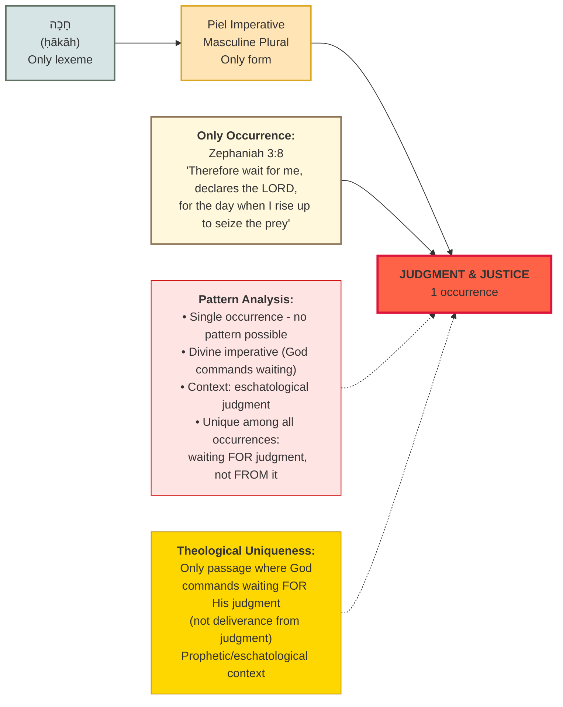

# Theme: Judgment & Justice

This diagram shows the grammatical path that leads to the "Judgment & Justice" theme (1 occurrence only).

```mermaid
graph LR
    Theme["<b>JUDGMENT & JUSTICE</b><br/>1 occurrence"]

    H["חָכָה<br/>(ḥākāh)<br/>Only lexeme"]

    PImp["Piel Imperative<br/>Masculine Plural<br/>Only form"]

    H --> PImp
    PImp --> Theme

    Verse["<b>Only Occurrence:</b><br/>Zephaniah 3:8<br/>'Therefore wait for me, declares the LORD,<br/>for the day when I rise up to seize the prey'"]

    Verse --> Theme

    Pattern["<b>Pattern Analysis:</b><br/>• Single occurrence - no pattern possible<br/>• Divine imperative (God commands waiting)<br/>• Context: eschatological judgment<br/>• Unique among all occurrences:<br/>  waiting FOR judgment, not FROM it"]

    Pattern -.-> Theme

    Notable["<b>Theological Uniqueness:</b><br/>Only passage where God<br/>commands waiting FOR His judgment<br/>(not deliverance from judgment)<br/>Prophetic/eschatological context"]

    Notable -.-> Theme

    style Theme fill:#FF6347,stroke:#DC143C,stroke-width:3px
    style H fill:#D6E4E5,stroke:#5F7161,stroke-width:2px
    style PImp fill:#FFE4B5,stroke:#DAA520,stroke-width:2px
    style Verse fill:#FFF8DC,stroke:#8B7355,stroke-width:2px
    style Pattern fill:#FFE4E4,stroke:#CC0000,stroke-width:1px
    style Notable fill:#FFD700,stroke:#B8860B,stroke-width:1px
```
