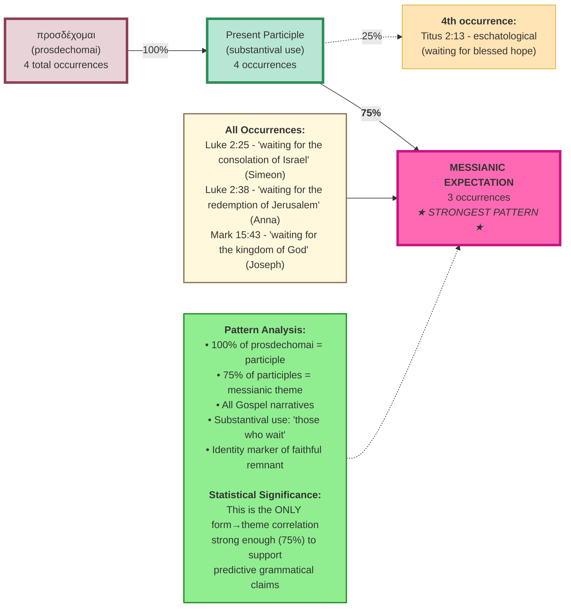

# Theme: Messianic Expectation

This diagram shows the grammatical paths that lead to the "Messianic Expectation" theme (3 occurrences) - the STRONGEST grammar→theme correlation in the entire dataset.

