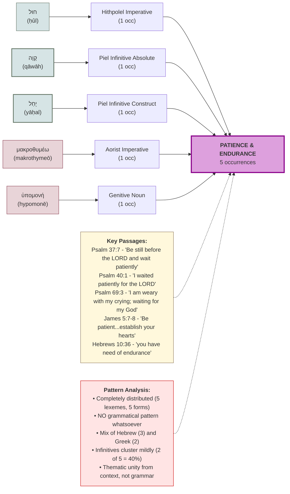

# Theme: Patience & Endurance

This diagram shows the grammatical paths that lead to the "Patience & Endurance" theme (5 occurrences).

```mermaid
graph LR
    Theme["<b>PATIENCE & ENDURANCE</b><br/>5 occurrences"]

    CH["חוּל<br/>(ḥûl)"]
    Q["קָוָה<br/>(qāwāh)"]
    Y["יָחַל<br/>(yāḥal)"]
    MA["μακροθυμέω<br/>(makrothymeō)"]
    UP["ὑπομονή<br/>(hypomonē)"]

    HithImp["Hithpolel Imperative<br/>(1 occ)"]
    PInfAbs["Piel Infinitive Absolute<br/>(1 occ)"]
    PInfCon["Piel Infinitive Construct<br/>(1 occ)"]
    AorImp["Aorist Imperative<br/>(1 occ)"]
    Noun["Genitive Noun<br/>(1 occ)"]

    CH --> HithImp
    Q --> PInfAbs
    Y --> PInfCon
    MA --> AorImp
    UP --> Noun

    HithImp --> Theme
    PInfAbs --> Theme
    PInfCon --> Theme
    AorImp --> Theme
    Noun --> Theme

    Verses["<b>Key Passages:</b><br/>Psalm 37:7 - 'Be still before the LORD and wait patiently'<br/>Psalm 40:1 - 'I waited patiently for the LORD'<br/>Psalm 69:3 - 'I am weary with my crying; waiting for my God'<br/>James 5:7-8 - 'Be patient...establish your hearts'<br/>Hebrews 10:36 - 'you have need of endurance'"]

    Verses -.-> Theme

    Pattern["<b>Pattern Analysis:</b><br/>• Completely distributed (5 lexemes, 5 forms)<br/>• NO grammatical pattern whatsoever<br/>• Mix of Hebrew (3) and Greek (2)<br/>• Infinitives cluster mildly (2 of 5 = 40%)<br/>• Thematic unity from context, not grammar"]

    Pattern -.-> Theme

    style Theme fill:#DDA0DD,stroke:#8B008B,stroke-width:3px
    style CH fill:#D6E4E5,stroke:#5F7161,stroke-width:1px
    style Q fill:#D6E4E5,stroke:#5F7161,stroke-width:2px
    style Y fill:#D6E4E5,stroke:#5F7161,stroke-width:2px
    style MA fill:#E8D4D8,stroke:#8B3F52,stroke-width:1px
    style UP fill:#E8D4D8,stroke:#8B3F52,stroke-width:1px
    style Verses fill:#FFF8DC,stroke:#8B7355,stroke-width:1px
    style Pattern fill:#FFE4E4,stroke:#CC0000,stroke-width:1px
```
