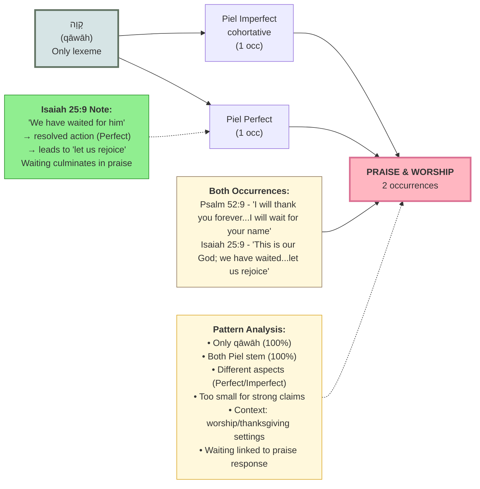

# Theme: Praise & Worship

This diagram shows the grammatical paths that lead to the "Praise & Worship" theme (2 occurrences).

```mermaid
graph LR
    Theme["<b>PRAISE & WORSHIP</b><br/>2 occurrences"]

    Q["קָוָה<br/>(qāwāh)<br/>Only lexeme"]

    PImf["Piel Imperfect<br/>cohortative<br/>(1 occ)"]
    PPf["Piel Perfect<br/>(1 occ)"]

    Q --> PImf
    Q --> PPf

    PImf --> Theme
    PPf --> Theme

    Verses["<b>Both Occurrences:</b><br/>Psalm 52:9 - 'I will thank you forever...I will wait for your name'<br/>Isaiah 25:9 - 'This is our God; we have waited...let us rejoice'"]

    Verses --> Theme

    Pattern["<b>Pattern Analysis:</b><br/>• Only qāwāh (100%)<br/>• Both Piel stem (100%)<br/>• Different aspects (Perfect/Imperfect)<br/>• Too small for strong claims<br/>• Context: worship/thanksgiving settings<br/>• Waiting linked to praise response"]

    Pattern -.-> Theme

    Notable["<b>Isaiah 25:9 Note:</b><br/>'We have waited for him'<br/>→ resolved action (Perfect)<br/>→ leads to 'let us rejoice'<br/>Waiting culminates in praise"]

    Notable -.-> PPf

    style Theme fill:#FFB6C1,stroke:#DB7093,stroke-width:3px
    style Q fill:#D6E4E5,stroke:#5F7161,stroke-width:3px
    style Verses fill:#FFF8DC,stroke:#8B7355,stroke-width:1px
    style Pattern fill:#FFF8DC,stroke:#DAA520,stroke-width:1px
    style Notable fill:#90EE90,stroke:#228B22,stroke-width:1px
```
