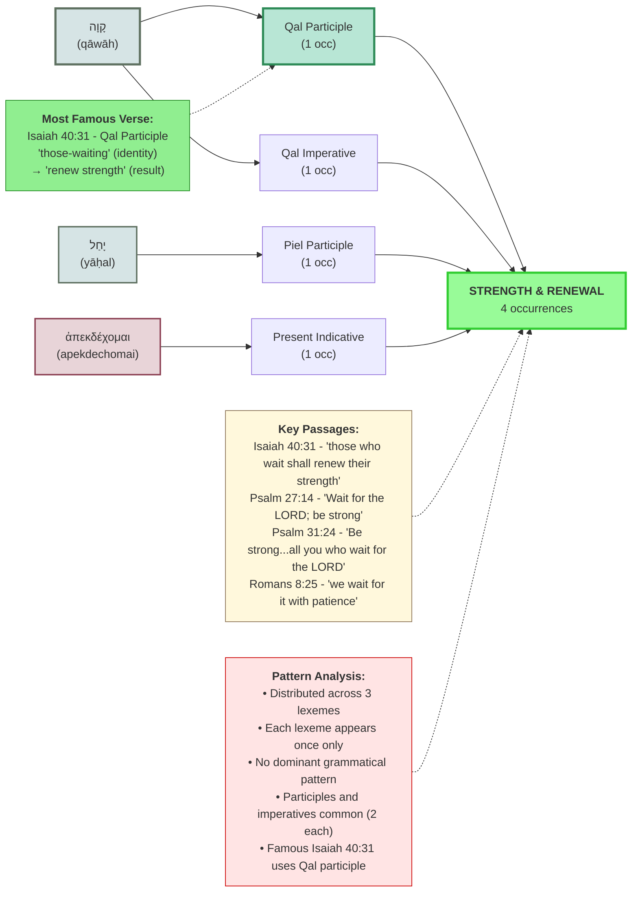

# Theme: Strength & Renewal

This diagram shows the grammatical paths that lead to the "Strength & Renewal" theme (4 occurrences).

```mermaid
graph LR
    Theme["<b>STRENGTH & RENEWAL</b><br/>4 occurrences"]

    Q["קָוָה<br/>(qāwāh)"]
    Y["יָחַל<br/>(yāḥal)"]
    AP["ἀπεκδέχομαι<br/>(apekdechomai)"]

    QPart["Qal Participle<br/>(1 occ)"]
    QImp["Qal Imperative<br/>(1 occ)"]
    PPart["Piel Participle<br/>(1 occ)"]
    PresInd["Present Indicative<br/>(1 occ)"]

    Q --> QPart
    Q --> QImp
    Y --> PPart
    AP --> PresInd

    QPart --> Theme
    QImp --> Theme
    PPart --> Theme
    PresInd --> Theme

    Verses["<b>Key Passages:</b><br/>Isaiah 40:31 - 'those who wait shall renew their strength'<br/>Psalm 27:14 - 'Wait for the LORD; be strong'<br/>Psalm 31:24 - 'Be strong...all you who wait for the LORD'<br/>Romans 8:25 - 'we wait for it with patience'"]

    Verses -.-> Theme

    Pattern["<b>Pattern Analysis:</b><br/>• Distributed across 3 lexemes<br/>• Each lexeme appears once only<br/>• No dominant grammatical pattern<br/>• Participles and imperatives common (2 each)<br/>• Famous Isaiah 40:31 uses Qal participle"]

    Pattern -.-> Theme

    Notable["<b>Most Famous Verse:</b><br/>Isaiah 40:31 - Qal Participle<br/>'those-waiting' (identity)<br/>→ 'renew strength' (result)"]

    Notable -.-> QPart

    style Theme fill:#98FB98,stroke:#32CD32,stroke-width:3px
    style Q fill:#D6E4E5,stroke:#5F7161,stroke-width:3px
    style Y fill:#D6E4E5,stroke:#5F7161,stroke-width:2px
    style AP fill:#E8D4D8,stroke:#8B3F52,stroke-width:2px
    style QPart fill:#B8E6D5,stroke:#2E8B57,stroke-width:3px
    style Verses fill:#FFF8DC,stroke:#8B7355,stroke-width:1px
    style Pattern fill:#FFE4E4,stroke:#CC0000,stroke-width:1px
    style Notable fill:#90EE90,stroke:#228B22,stroke-width:1px
```
