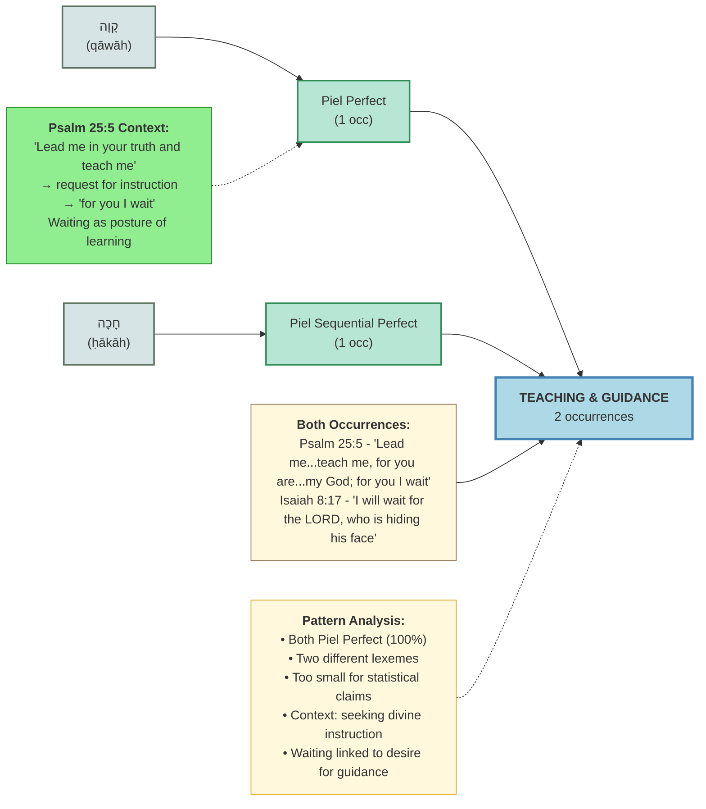

# Theme: Teaching & Guidance

This diagram shows the grammatical paths that lead to the "Teaching & Guidance" theme (2 occurrences).

```mermaid
graph LR
    Theme["<b>TEACHING & GUIDANCE</b><br/>2 occurrences"]

    Q["קָוָה<br/>(qāwāh)"]
    H["חָכָה<br/>(ḥākāh)"]

    PPf1["Piel Perfect<br/>(1 occ)"]
    PPf2["Piel Sequential Perfect<br/>(1 occ)"]

    Q --> PPf1
    H --> PPf2

    PPf1 --> Theme
    PPf2 --> Theme

    Verses["<b>Both Occurrences:</b><br/>Psalm 25:5 - 'Lead me...teach me, for you are...my God; for you I wait'<br/>Isaiah 8:17 - 'I will wait for the LORD, who is hiding his face'"]

    Verses --> Theme

    Pattern["<b>Pattern Analysis:</b><br/>• Both Piel Perfect (100%)<br/>• Two different lexemes<br/>• Too small for statistical claims<br/>• Context: seeking divine instruction<br/>• Waiting linked to desire for guidance"]

    Pattern -.-> Theme

    Notable["<b>Psalm 25:5 Context:</b><br/>'Lead me in your truth and teach me'<br/>→ request for instruction<br/>→ 'for you I wait'<br/>Waiting as posture of learning"]

    Notable -.-> PPf1

    style Theme fill:#ADD8E6,stroke:#4682B4,stroke-width:3px
    style Q fill:#D6E4E5,stroke:#5F7161,stroke-width:2px
    style H fill:#D6E4E5,stroke:#5F7161,stroke-width:2px
    style PPf1 fill:#B8E6D5,stroke:#2E8B57,stroke-width:2px
    style PPf2 fill:#B8E6D5,stroke:#2E8B57,stroke-width:2px
    style Verses fill:#FFF8DC,stroke:#8B7355,stroke-width:1px
    style Pattern fill:#FFF8DC,stroke:#DAA520,stroke-width:1px
    style Notable fill:#90EE90,stroke:#228B22,stroke-width:1px
```
