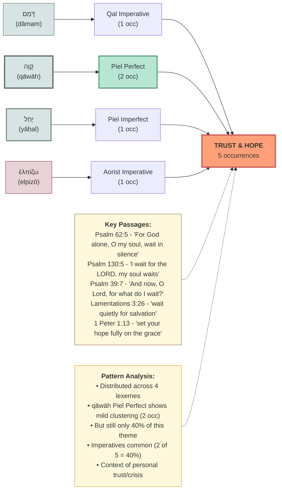

# Theme: Trust & Hope

This diagram shows the grammatical paths that lead to the "Trust & Hope" theme (5 occurrences).

```mermaid
graph LR
    Theme["<b>TRUST & HOPE</b><br/>5 occurrences"]

    D["דָּמַם<br/>(dāmam)"]
    Q["קָוָה<br/>(qāwāh)"]
    Y["יָחַל<br/>(yāḥal)"]
    EL["ἐλπίζω<br/>(elpizō)"]

    QImp["Qal Imperative<br/>(1 occ)"]
    PPf["Piel Perfect<br/>(2 occ)"]
    PImpY["Piel Imperfect<br/>(1 occ)"]
    AorImp["Aorist Imperative<br/>(1 occ)"]

    D --> QImp
    Q --> PPf
    Y --> PImpY
    EL --> AorImp

    QImp --> Theme
    PPf --> Theme
    PImpY --> Theme
    AorImp --> Theme

    Verses["<b>Key Passages:</b><br/>Psalm 62:5 - 'For God alone, O my soul, wait in silence'<br/>Psalm 130:5 - 'I wait for the LORD, my soul waits'<br/>Psalm 39:7 - 'And now, O Lord, for what do I wait?'<br/>Lamentations 3:26 - 'wait quietly for salvation'<br/>1 Peter 1:13 - 'set your hope fully on the grace'"]

    Verses -.-> Theme

    Pattern["<b>Pattern Analysis:</b><br/>• Distributed across 4 lexemes<br/>• qāwāh Piel Perfect shows mild clustering (2 occ)<br/>• But still only 40% of this theme<br/>• Imperatives common (2 of 5 = 40%)<br/>• Context of personal trust/crisis"]

    Pattern -.-> Theme

    style Theme fill:#FFA07A,stroke:#CD5C5C,stroke-width:3px
    style D fill:#D6E4E5,stroke:#5F7161,stroke-width:1px
    style Q fill:#D6E4E5,stroke:#5F7161,stroke-width:3px
    style Y fill:#D6E4E5,stroke:#5F7161,stroke-width:2px
    style EL fill:#E8D4D8,stroke:#8B3F52,stroke-width:1px
    style PPf fill:#B8E6D5,stroke:#2E8B57,stroke-width:2px
    style Verses fill:#FFF8DC,stroke:#8B7355,stroke-width:1px
    style Pattern fill:#FFF8DC,stroke:#DAA520,stroke-width:1px
```
