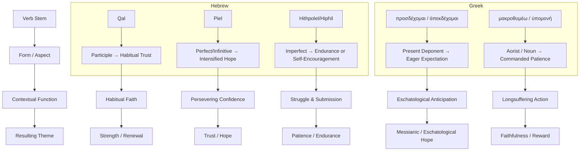

# Waiting on the Lord — Grammatical & Contextual Summary

## 1. Overview

The lexical study of “waiting” on the Lord reveals that **theme classification** arises not only from the semantic root (lexeme) but also from the **morphological stem (Qal, Piel, Hithpolel, etc.)**, the **verbal form (perfect, imperfect, participle, imperative, infinitive)**, and the **syntactic or rhetorical context** in which it appears.  
Thus, each thematic group—*Strength, Trust, Patience, Deliverance*, etc.—emerges as a grammatical–contextual pattern rather than mere interpretive labeling.

---

## 2. Hebrew Verbal Patterns

| Stem | Core Meaning | Effect on Theme |
|------|---------------|----------------|
| **Qal** | Simple, declarative action; often habitual or general. | Waiting as **steady trust**, often leading to *inheritance* or *faithfulness*. |
| **Piel** | Intensive or declarative nuance; emphasizes persistence or inward exertion. | Waiting as **active endurance**, *spiritual discipline*, or *emphatic hope*. |
| **Hiphil** | Causative; to “cause oneself to hope.” | Waiting as **volitional trust**, self-directed faith under duress. |
| **Hithpolel** | Reflexive, iterative, emotionally intense. | Waiting as **struggle**, *wrestling patience*, or *emotional endurance*. |
| **Participle** | Continuous aspect; habitual identity. | Waiting as **character trait**, not single event. |
| **Imperative** | Command form; volitional exhortation. | Waiting as **moral directive** or **faith decision**. |
| **Infinitive Absolute/Construct** | Intensified or durative action. | Waiting as **total persistence** or **heightened devotion**. |

---

## 3. Greek Verbal Patterns

| Lexeme | Aspect | Thematic Function |
|---------|---------|-------------------|
| **προσδέχομαι (prosdechomai)** | Ongoing, middle deponent (reflexive reception). | Emphasizes **expectant readiness**—messianic or eschatological hope. |
| **ἀπεκδέχομαι (apekdechomai)** | Intensified compound (“eagerly await”). | Marks **eschatological tension**—the “already/not-yet” of salvation. |
| **μακροθυμέω / ὑπομονή** | Active endurance and long-suffering. | Highlights **patience under injustice**. |
| **ἐλπίζω** | Decisive, mental discipline of hope. | Frames **rational, disciplined expectation** rather than passive waiting. |
| **ἀναμένω** | Simple waiting; purposeful orientation. | **Conversional reorientation**—life turned toward divine fulfillment. |

---

## 4. Thematic Derivation by Grammatical Logic

### **A. Strength & Renewal (Isa 40:31; Ps 27:14; Rom 8:25)**
Participles (habitual orientation) + imperatives (volitional exhortation) in Qal/Piel yield *ongoing trust* as divine empowerment.

### **B. Trust & Hope (Ps 62:5; Lam 3:26; 1 Pet 1:13)**
Perfects and imperatives denote *completed commitment* and *active dependence*, revealing waiting as *exclusive trust*.

### **C. Patience & Endurance (Ps 37:7; Jas 5:7–8; Heb 10:36)**
Hithpolel/Piel infinitives intensify internal struggle; Greek aorist imperatives frame *decisive endurance*. Waiting becomes *refined perseverance*.

### **D. Help & Deliverance (Ps 33:20; Isa 33:2; Mic 7:7)**
Perfects (completed waiting) + Hiphil (causative faith) = *past waiting legitimates present appeal*.

### **E. Blessing & Inheritance (Ps 37; Isa 30:18; Gal 5:5)**
Qal participles/imperatives link *habitual obedience* to *covenantal reward*.

### **F. Teaching & Guidance (Ps 25:5; Isa 8:17)**
Sequential perfects emphasize *continuity under silence*—waiting becomes a learner’s disposition.

### **G. Praise & Worship (Ps 52:9; Isa 25:9)**
Cohortative + perfect yield *resolved praise after fulfilled expectation*. Waiting turns testimony into worship.

### **H. Faithfulness & Devotion (Isa 26:8; Hos 12:6)**
Imperative + perfect highlight *perpetual obedience*. Waiting = lived devotion.

### **I. Goodness of God (Lam 3:25; Isa 64:4)**
Participles function as identity markers—waiting defines *who experiences divine goodness*.

### **J. Judgment & Justice (Zeph 3:8)**
Imperative tied to divine “until” clause = *ethical restraint before divine action*.

### **K. Messianic Expectation (Luke 2; Mark 15)**
Present participles (prosdechomai) = *characteristic expectancy*. Waiting produces faithful action.

### **L. Eschatological Hope (Titus 2:13; Phil 3:20; 1 Thess 1:10)**
Present participles (apekdechomai, anamenō) = *continuous anticipation*. Waiting becomes *eschatological orientation*.

---

## 5. Conceptual Flow

---

## 6. Glossary of Key Grammatical Terms

**Participle:** A verbal adjective expressing continuous or habitual action. In Hebrew, it can serve as a noun (“the one who waits”). In Greek, it often denotes ongoing or attendant circumstance.

**Deponent:** A Greek verb appearing in the middle/passive form but carrying active meaning (e.g., *προσδέχομαι*, “I wait for”).

**Cohortative:** A Hebrew volitional form (usually 1st person) expressing determination or resolve (“Let me wait”). It softens imperative force while retaining intent.

**Perfect (Hebrew):** Completed or holistic action; may express a present state resulting from a past act.

**Imperfect (Hebrew):** Ongoing, habitual, or future action; expresses incompletion or repetition.

**Perfect (Greek):** Describes an action completed in the past with results continuing into the present (e.g., *it stands written*).

**Imperfect (Greek):** Denotes continuous or repeated past action—“was waiting,” “kept hoping.”

**Stem (Hebrew Binyan):** Morphological system modifying verb roots (Qal, Piel, Hiphil, etc.), each giving nuance such as intensity, causation, or reflexivity.

**Aspect (Greek):** Indicates the type of action (ongoing, completed, simple event) rather than its time. Greek prioritizes aspect over strict tense.

**Voice:** Indicates the relation between the subject and the action (active, middle, passive). Middle often overlaps with reflexive meaning in deponent verbs.

**Mood:** Conveys the speaker’s intent (indicative = statement, imperative = command, subjunctive = potential). Hebrew equivalents use particle and stem changes.

---

## 7. Summary Insight

Across both languages, **morphology mirrors theology**. The shape of the verb—its stem, form, and aspect—expresses the kind of waiting: whether *habitual trust*, *agonized endurance*, or *eager anticipation*. Waiting is thus a **verbal theology of faith-in-action**.
